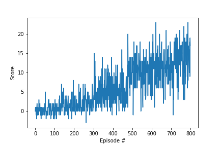

# DRLND_P1_Navigation


## Problem Statement:
Goal is to train an agent to navigate (and collect bananas!) in a large, square world:


A reward of +1 is provided for collecting a yellow banana, and a reward of -1 is provided for collecting a blue banana. Thus, the goal of your agent is to collect as many yellow bananas as possible while avoiding blue bananas.

The state space has 37 dimensions and contains the agent's velocity, along with ray-based perception of objects around the agent's forward direction. Given this information, the agent has to learn how to best select actions. Four discrete actions are available, corresponding to:

    0 - move forward.
    1 - move backward.
    2 - turn left.
    3 - turn right.

The task is episodic, and in order to solve the environment, your agent must get an average score of +13 over 100 consecutive episodes.

## Setup the environment:
- Step 1: Clone the [DRLND Repository](https://github.com/udacity/deep-reinforcement-learning#dependencies)
- Step 2 Dpwnload the [Unity Environment](https://s3-us-west-1.amazonaws.com/udacity-drlnd/P1/Banana/Banana_Linux.zip)
 - Optional: Dependencies are detailed in drnld.yml file.  To install same environment the current code was executed:
```
conda env create -f environment.yml
```
This will install needed libraries. 


## Solution:
- 1) Navigation.ipynb describes the complete solution. 
- 2) dqn_agent.py describes the agent to update Q values.  
- 3) model.py describes the neural network used for function approximation. 
- 4) checkpoint.pth stores the trained model weights
- 4) Final score plot as number of episodes: 



## Future work: 
- 1) Use ideas from [Rainbow: Combining Improvements in Deep Reinforcement Learning](https://arxiv.org/abs/1710.02298) to further improve the perfomance 
- 2) Learn from pixels directly. 
